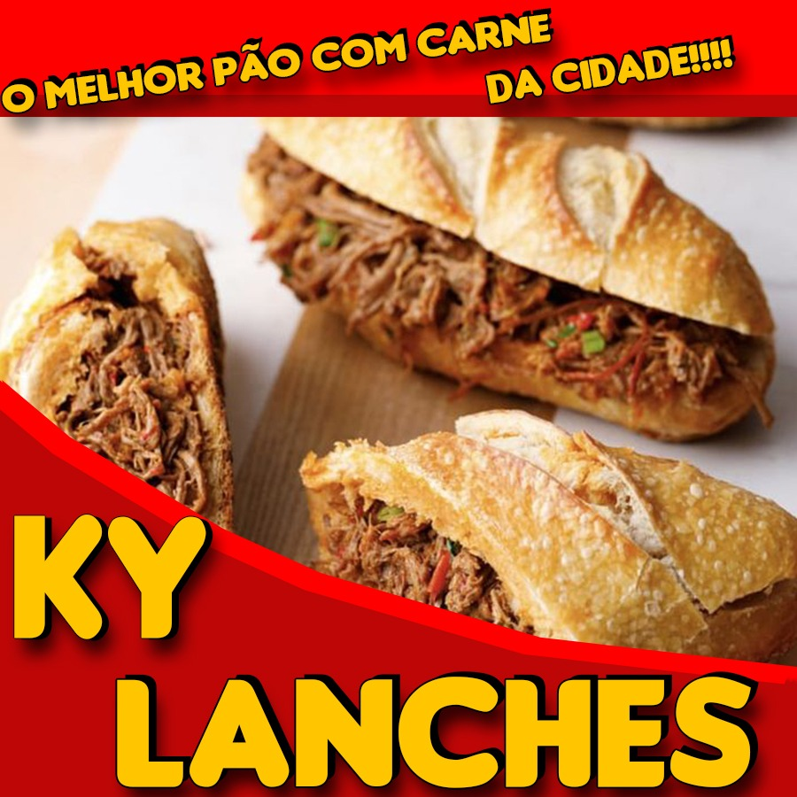

# PAINEL DE CONTROLE - JCGontijo

  

O Painel de Controle é um software ERP que tem como intuito o auxílio na gestão de vendas e financeira do empreendimento KY LANCHES.

- Interface gráfica amigável e bonita;
- Aplicação com perfis múltiplos: Usuários Padrão e Administrador;
- Desenvolvido pelos Alunos da UNICEPLAC

## Contributors / Colaboradores
  

:rocket: Project with MVC and Java applications. 

> :rocket: **Projeto com MVC e aplicações em Java.**

## Built with / Feito com

 
  
  
  
  
  

  - Java 11;
  - Spring 2.4.4;
  - Oracle 19-c;
  - Thymeleaf;
  - BOOTSTRAP;

## UML Class Diagram v2.5 / Diagrama de Classe UML v2.5

## Commits History / Histórico de commits
- Veja [Histórico de Commits](https://github.com/pedroynk/ky-lanches/commits/main) dos Colaboradores